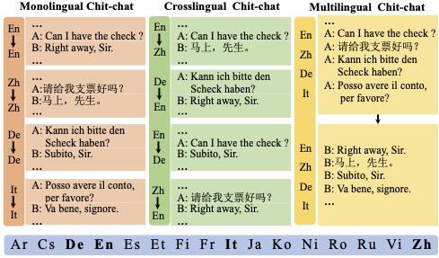

# XDailyDialog: A Multilingual Parallel Corpus for Chit-chat

This [repository](https://github.com/liuzeming01/XDailyDialog) includes the dataset and baseilnes of the paper: XDailyDialog: A Multilingual Parallel Corpus for Chit-chat. You can also visit this [website of XDailyDialog](https://liuzeming01.github.io/XDailyDialog/) to see details. 

Authors: Zeming Liu*, Ping Nie*, Jie Cai*, Haifeng Wang, Zheng-Yu Niu, Peng Zhang, Yuyu Zhang, Mrinmaya Sachan, Kaiping Peng

## What's New
- 2023/05/13 
- 2023/05/12 Update datesets full version.

We created this dataset based on the popular dialogue dataset (English Only): [DailyDialog: A Manually Labelled Multi-turn Dialogue Dataset](https://arxiv.org/pdf/1710.03957.pdf)
## 1. Abstract:

In this paper, we provide a multilingual parallel chit-chat dataset, XDailyDialog, to enable researchers to explore the challenging task of multilingual and cross-lingual Chit-chat. The difference between XDailyDialog and existing chit-chat datasets is that the conversation in XDailyDialog is annotated in multilingual and is parallel, while other datasets are restricted to a single language or are not parallel. We collect 13K dialogs aligned across 4 languages (52K dialogues and 410K utterances in total). We then propose a conversation generation framework, kNN-Chat, with a novel kNN-search mechanism that can support unified response retrieval for monolingual, multilingual, and cross-lingual chit-chat generation. Experiment results show that the use of multilingual data can bring performance improvement for monolingual chit-chat, indicating the benefits of XDailyDialog. Finally, this dataset provides a challenging testbed for future studies of monolingual,12
multilingual, and cross-lingual chit-chat.

## 2. Dataset

Data are avalible in data folder (Full dataset wiil be avalible after our paper is published! We randomly sampled 1k dialogues from English, Chinese, German and Italian data during review period). Dialogues, topics, emotion and action labels are in the same format as [DailyDialog: A Manually Labelled Multi-turn Dialogue Dataset](https://arxiv.org/pdf/1710.03957.pdf). We provide mannually labelled `dialogues_text_De` for German, `dialogues_text_It` for Italian and `dialogues_text_Zh` for Chinese version.  All files in `data` folders are:
```
ls ./data
data/
├── 1k_part_data
│   ├── dialogues_action.txt
│   ├── dialogues_emotion.txt
│   ├── dialogues_text_De.txt
│   ├── dialogues_text_En.txt
│   ├── dialogues_text_It.txt
│   ├── dialogues_text_Zh.txt
│   └── dialogues_topic.txt
├── dataset.py
├── dialogues_action.txt
├── dialogues_emotion.txt
├── dialogues_text_De.txt
├── dialogues_text_En.txt
├── dialogues_text_It.txt
├── dialogues_text_Zh.txt
└── dialogues_topic.txt
```

## 3. Basic Statistics

The developed XDailyDialog dataset contains 52,472 Manually Labelled multi-lingual multi-turn dialogues for four languages (English, Chinese, German, Italian). English data is come from [DailyDialog: A Manually Labelled Multi-turn Dialogue Dataset](https://arxiv.org/pdf/1710.03957.pdf). 



## 4. Requirements
To run baselines, python libraries blow are needed.
- sentencepiece           0.1.96
- datasets                1.8.0
- transformers            4.7.0
- jieba                   0.42.1
- nltk                    0.8.1
- sacrebleu               2.3.1

## 5. Preprocess
run `parser.py` to convert original txt data into Monolingual, Multi-lingual, Cross-lingual settings. Then run `split.py` to split data into train, dev and test. Then we need to run `preprocess.py` to process our txt data from different tasks into standard `datasets` input format, you also need to put our tasks txt data in./data/raw/ like:
```
python parser.py
python split.py
python preprocess.py
```
```
data
├── crosslingual
│   ├── De_En
│   ├── En_De
│   ├── En_Zh
│   └── Zh_En
├── dataset.py
├── monolingual
│   ├── De
│   ├── En
│   ├── It
│   └── Zh
├── multilingual
│   ├── dev.jsonl
│   ├── test.jsonl
│   └── train.jsonl
├── raw
│   ├── crosslingual
│   ├── monolingual
│   └── multilingual
```

run our preprocess.py. Then you will get the preprocessed data in `./data` like above.

```
python preprocess.py
``` 

## 6. Reproduce Baselines

you can run run.bash to reproduce our results.

```
sh run.bash 0 data/monolingual/It
```

`0` means the gpu=0 and `data/monolingual/It` is the data directory we want to train and evaluate our model. You can change model names in run.bash to run different models. 

Parameters in `run.bash`:
```
export PYTHONIOENCODING=utf8

export CUDA_VISIBLE_DEVICES=$1 # gpu number

WORKING_DIR=./ #your work dir where run.bash is in. 

DATA_NAME=$2  # "data/monolingual/En", task name and corresponding directory. 
EPOCHS=5
BATCH_SIZE=4
EVAL_BATCH_SIZE=4
GRAD_ACC=2
LR=2e-5

MODEL="mt5-base" # model name 
# CKPT_PATH="${WORKING_DIR}/checkpoints/mt5-base/"
CKPT_PATH="google/mt5-base"
SAVE_PATH="${WORKING_DIR}/results/${DATA_NAME}/${MODEL}/ep${EPOCHS}_bs${BATCH_SIZE}_lr${LR}_G${GRAD_ACC}"

OPTS=" --model_name_or_path ${CKPT_PATH} \
--data_path ${WORKING_DIR} \
--data_name ${DATA_NAME} \
--output_dir ${SAVE_PATH} \
--max_source_length 512 \
--max_target_length 200 \
--val_max_target_length 200 \
--do_train \
--do_eval \
--do_predict \
--num_train_epochs ${EPOCHS} \
--per_device_train_batch_size ${BATCH_SIZE} \
--per_device_eval_batch_size ${EVAL_BATCH_SIZE} \
--gradient_accumulation_steps ${GRAD_ACC} \
--learning_rate ${LR} \
--logging_steps 500 \
--evaluation_strategy epoch \
--save_strategy epoch \
--warmup_steps 500 \
--disable_tqdm False \
--load_best_model_at_end True \
--metric_for_best_model bleu-2 \
--save_total_limit 2"
```
## 7. License

Apache License 2.0 and CC BY-NC-SA 4.0.

Since DailyDialog dataset is licensed under CC BY-NC-SA 4.0. Note the dataset may not be adopted for commercial use.
